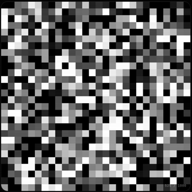
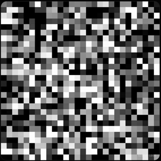
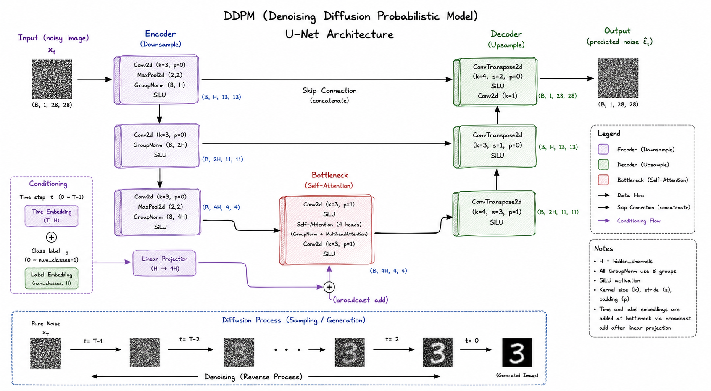
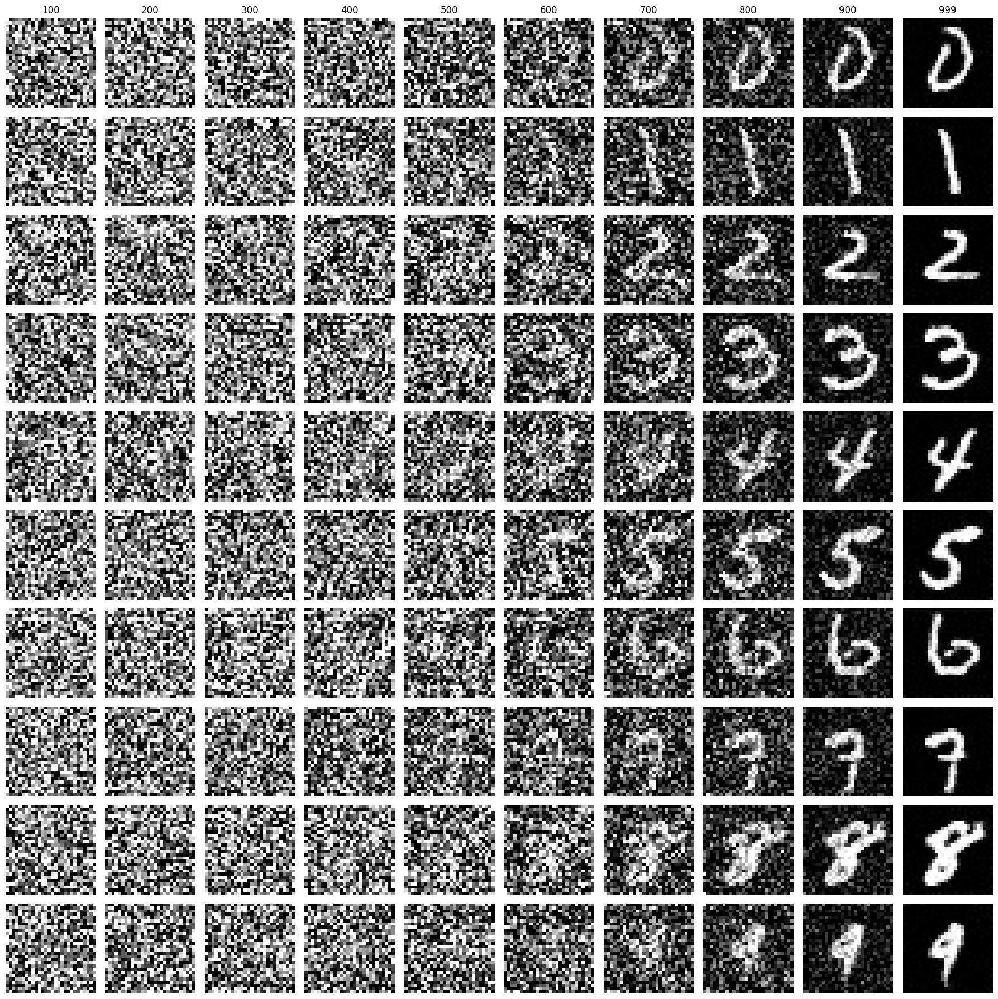

# Class-Conditional DDPM Digit Generator (MNIST)

[](https://arxiv.org/pdf/2006.11239)
[](https://opensource.org/licenses/MIT)

An interactive, browser-based implementation of a **Class-Conditional Denoising Diffusion Probabilistic Model (DDPM)** trained on the MNIST dataset. The model generates digits from 0 to 9 step-by-step, starting from pure random noise.

---

### 🚀 **[Try the Interactive Web App Now](./index.html)**
*(Note: To run the web app, please host it using a local server due to browser CORS policies. See [Running the Web UI](#3-running-the-web-ui) below).*

---

## 🌪️ Denoising Diffusion in Action

Denoising Diffusion Probabilistic Models (DDPM) work by first adding noise to an image step-by-step (Forward Process) until it becomes pure white noise. The neural network is trained to reverse this process, predicting and removing the noise at each step to reconstruct the target image (Reverse Process).

Below are animations showing the step-by-step denoising process (from $t = 1000$ down to $t = 0$) for generating digits **3** and **5**:

| Generating Digit `3` | Generating Digit `5` |
| :---: | :---: |
|  |  |

---

## 📐 Model Architecture

The neural network uses a **U-Net architecture with Self-Attention** at the bottleneck, conditioned on both the diffusion timestep $t$ and the target class label (digit 0-9).



### Key Architectural Features:
- **Encoder:** Downsamples the image features using 2D convolutions, max-pooling, and Group Normalization.
- **Bottleneck with Self-Attention:** A multi-head self-attention layer helps capture global context and relationships across pixels.
- **Conditioning Injection:** Timestep embeddings (via `nn.Embedding`) and class label embeddings (via `nn.Embedding`) are summed together and projected to match the bottleneck channels, then added directly to inject target information.
- **Decoder:** Upsamples the features back to $28 \times 28$ pixels using ConvTranspose2d.
- **Skip Connections:** Connects the encoder feature maps directly to the decoder to preserve fine-grained spatial details.

---

## 🔢 Generated Digits (10x10 Grid)

Below is a grid of 100 generated digits ($10 \times 10$, with 10 samples per digit class from 0 to 9), demonstrating the model's ability to generate distinct, high-quality digits conditioned on user input:



---

## 📂 File Directory Structure

Here is a guide to what each file in this repository is responsible for:

| File / Folder | Description |
| :--- | :--- |
| **`index.html`** | Interactive web UI that loads the ONNX model and runs the denoising process directly in your browser. |
| **`ddpm_script.py`** | PyTorch training script. Downloads MNIST, initializes the model, runs the training loop, and saves model checkpoints. |
| **`onxx_converter.py`** | Script to export the PyTorch checkpoints into a single, browser-friendly ONNX model and generate the noise schedule parameters. |
| **`Model_architecture/`** | Directory containing different model architectures: |
| ├── **`DDPM_unnet_attntion.py`** | U-Net with Self-Attention at the bottleneck (default model). |
| ├── **`DDPM_unet.py`** | Standard U-Net architecture without attention. |
| └── **`DDPM_cnn.py`** | Simple CNN-based architecture. |
| **`image_noise.ipynb`** | Jupyter notebook containing interactive visualizations of the forward/reverse noise processes. |
| **`noise_schedule.json`** | Pre-computed cosine/linear beta schedule variables used by the browser application. |
| **`ddpm_mnist.onnx`** | The exported ONNX format of the trained model, optimized for browser execution. |
| **`Models/`** | Folder where PyTorch model checkpoints (`.pt`) are saved during training. |
| **`data/`** | Directory containing the MNIST dataset and visual assets (GIFs, architecture diagram). |

---

## 🛠️ How to Use

### 1. Training the Model (PyTorch)
If you want to train the model from scratch on the MNIST dataset:
```bash
python ddpm_script.py
```
This script will:
- Download the MNIST dataset under `data/`.
- Train the U-Net with Attention model.
- Save model checkpoints in the `Models/` directory after each epoch.

### 2. Exporting to ONNX
To prepare the trained model for the browser:
1. Ensure you have a checkpoint saved (e.g., `Models/attention_model_100.pt` or edit the path in `onxx_converter.py`).
2. Run the converter:
   ```bash
   python onxx_converter.py
   ```
This generates `ddpm_mnist.onnx` and `noise_schedule.json` in the root folder.

### 3. Running the Web UI
Since the web UI uses `fetch()` to load the ONNX model and the noise schedule JSON, opening `index.html` directly as a local file (`file://`) will trigger **CORS errors** in most modern browsers.

To run it, start a simple HTTP server in the repository root:

#### Option A: Using Python (Pre-installed)
```bash
python -m http.server 8000
```
Then visit: `http://localhost:8000`

#### Option B: Using Node.js / npx
```bash
npx serve .
```
Then visit: `http://localhost:3000` (or the port specified).

Once loaded, you can select any digit from 0 to 9, click **Random**, or adjust the display update speed to see the diffusion process run in real-time right inside your browser!
